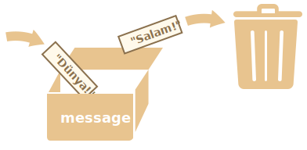

# Dəyişənlər

Çox vaxt JavaScript tətbiqləri məlumatlarla işləməlidir. Məsələn:
1. Onlayn mağaza -- məlumatlar satılan məhsulları və alış-veriş səbətini əhatə edə bilər.
2. Çat tətbiqi -- məlumatlar istifadəçiləri, mesajları və daha çoxunu ehtiva edə bilər.

Dəyişənlər bu məlumatları saxlamaq üçün istifadə olunur.

## Dəyişən

[Dəyişən (variable)](https://en.wikipedia.org/wiki/Variable_(computer_science)), məlumatlar üçün "adlandırılmış yaddaş" yeridir. Biz dəyişənlərdən məhsulları, ziyarətçiləri və digər məlumatları yadda saxlamaq üçün istifadə edə bilərik.

JavaScript-də dəyişən yaratmaq üçün `let` açar sözündən istifadə edin.

Aşağıdakı ifadə "message" adlı bir dəyişən yaradır (başqa sözlə "elan edir"):

```js
let message;
```

İndi biz mənimsətmə operatorundan (`=`) istifadə edərək bu dəyişənə bəzi məlumatlar yerləşdirə bilərik:

```js
let message;

*!*
<<<<<<< HEAD
message = 'Salam'; // Mətni saxla
=======
message = 'Hello'; // store the string 'Hello' in the variable named message
>>>>>>> 6236eb8c3cdde729dab761a1d0967a88a1a6197e
*/!*
```

İndi, mətn dəyəri dəyişənə bağlı olan yaddaş sahəsində saxlanılır. Biz, dəyişənin adından istifadə edərək bu dəyəri oxuya bilərik:

```js run
let message;
message = 'Salam!';

*!*
alert(message); // dəyişənin kontentini göstər
*/!*
```

Yığcam kod yazmaq üçün biz dəyişənin yaranmasını və təyinatını bir sətirdə birləşdirə bilərik:

```js run
let message = 'Salam!'; // Dəyişəni müəyyənləşdir və dəyəri təyin et

alert(message); // Salam!
```

Biz, həmçinin bir neçə dəyişəni eyni sətirdə müəyyənləşdirə bilərik:

```js no-beautify
let user = 'Orxan', age = 25, message = 'Salam';
```

Bunun daha qısa olmasına baxmayaraq biz belə kod yazmağı tövsiyə etmirik. Oxunaqlığı çoxaltmaq üçün hər dəyişən üçün ayrı sətir istifadə edin.

Çox sətirli variantın bir az uzun olmasına baxmayaraq bunu oxumaq daha asandır:

```js
let user = 'Orxan';
let age = 25;
let message = 'Salam';
```

<<<<<<< HEAD
Bəzi proqramçılar bir neçə dəyişəni aşağıdakı formada:
=======
Some people also define multiple variables in this multiline style:

>>>>>>> 6236eb8c3cdde729dab761a1d0967a88a1a6197e
```js no-beautify
let user = 'Orxan',
  age = 25,
  message = 'Salam';
```

...və ya "vergül-birinci" stilində (comma-first style) də müəyyənləşdirirlər:

```js no-beautify
let user = 'Orxan'
  , age = 25
  , message = 'Salam';
```

Texniki olaraq yuxarıdakı bütün variantlar eyni nəticəni verəcək. Bu səbəbdən, burada vacib olan proqramçıların şəxsi zövqüdür.

<<<<<<< HEAD

````smart header="`let` əvəzinə `var`"
Siz, köhnə skriptlərdə `let` əvəzinə `var` açar sözünün işlədildiyini görə bilərsiniz:
=======
````smart header="`var` instead of `let`"
In older scripts, you may also find another keyword: `var` instead of `let`:
>>>>>>> 6236eb8c3cdde729dab761a1d0967a88a1a6197e

```js
*!*var*/!* message = 'Salam';
```

<<<<<<< HEAD
`var` açar sözü `let` açar sözü ilə *demək olar ki* eynidir. O da dəyişən elan edir, lakin bir qədər fərqli, "köhnə üsulla".

`let` və `var` arasında olan hiss edilməyən fərqlər var. Lakin, indi bu fərqlər bizi maralandırmır. Biz, bu fərqlər haqqında <info:var> bölməsində detallı danışacağıq.
=======
The `var` keyword is *almost* the same as `let`. It also declares a variable but in a slightly different, "old-school" way.

There are subtle differences between `let` and `var`, but they do not matter to us yet. We'll cover them in detail in the chapter <info:var>.
>>>>>>> 6236eb8c3cdde729dab761a1d0967a88a1a6197e
````

## Real dünyada analogiya

Dəyişən anlayışını asanlıqla qavraya bilərik, əgər onu üzərində unikal ad yazılmış bir "etiket" olan məlumatlar üçün bir "qutu" kimi təsəvvür etsək.

<<<<<<< HEAD
Məsələn, `message` dəyişəni daxilində "Salam!" dəyəri olan və `"message"` adı ilə etiketlənən qutudur:
=======
For instance, the variable `message` can be imagined as a box labelled `"message"` with the value `"Hello!"` in it:
>>>>>>> 6236eb8c3cdde729dab761a1d0967a88a1a6197e


Biz qutuda istənilən dəyəri yerləşdirə bilərik.

<<<<<<< HEAD
Əlavə olaraq, biz bu dəyəri istədiyimiz qədər dəyişə bilərik:
=======
We can also change it as many times as we want:

>>>>>>> 6236eb8c3cdde729dab761a1d0967a88a1a6197e
```js run
let message;

message = 'Salam!';

message = 'Dünya!'; // dəyər dəyişdi

alert(message);
```

Dəyər dəyişdikdə dəyişəndə olan köhnə məlumat silinir:



Biz həmçinin iki dəyişən elan edib, məlumatı birindən digərinə köçürə bilərik.

```js run
let hello = 'Salam dünya!';

let message;

*!*
// 'Salam dünya' dəyərini hello dəyişənindən message dəyişəninə kopyala
message = hello;
*/!*

// indi, hər iki dəyişəndə eyni dəyər saxlanılır
alert(hello); // Salam dünya!
alert(message); // Salam dünya!
```

<<<<<<< HEAD
```smart header="Funksional dillər"
Nəzərinizə çatdırmaq istəyirik ki, [Scala](http://www.scala-lang.org/) və [Erlang](http://www.erlang.org/) kimi [funksional](https://en.wikipedia.org/wiki/Functional_programming) proqramlaşdırma dillərində dəyişənin dəyişilməsinə icazə verilmir.
=======
````warn header="Declaring twice triggers an error"
A variable should be declared only once.

A repeated declaration of the same variable is an error:

```js run
let message = "This";

// repeated 'let' leads to an error
let message = "That"; // SyntaxError: 'message' has already been declared
```
So, we should declare a variable once and then refer to it without `let`.
````

```smart header="Functional languages"
It's interesting to note that there exist so-called [pure functional](https://en.wikipedia.org/wiki/Purely_functional_programming) programming languages, such as [Haskell](https://en.wikipedia.org/wiki/Haskell), that forbid changing variable values.
>>>>>>> 6236eb8c3cdde729dab761a1d0967a88a1a6197e

Belə dillərdə, dəyər "qutunun içinə" bir dəfə yerləşdirildikdən sonra, o, orada əbədi qalır. Əgər başqa bir şey saxlamağımız lazım olarsa, dil bizi yeni bir qutu (yeni dəyişən elan etməyi) yaratmağa məcbur edir. Köhnəsini yenidən istifadə edə bilmirik.

<<<<<<< HEAD
İlk baxışda bunun bir az qəribə olmasına baxmayaraq bu dillərdə çox ciddi təkmilləşdirmə etmək mümkündür. Bundan əlavə, paralel hesablamalar kimi bəzi tapşırıqlarda bu məhdudiyyətin olmasının faydası var. Fikrinizi genişləndirmək üçün bu formalı dili öyrənməyi (hətta bunu istifadə etməyi planlaşdırmasanız belə) tövsiyə edirik.
=======
Though it may seem a little odd at first sight, these languages are quite capable of serious development. More than that, there are areas like parallel computations where this limitation confers certain benefits.
>>>>>>> 6236eb8c3cdde729dab761a1d0967a88a1a6197e
```

## Dəyişənlərin adlandırılması [#variable-naming]

JavaScript-də dəyişənlərin adlandırılmasında iki məhdudiyyət var:

1. Dəyişən adında yalnız hərflər, rəqəmlər və ya `$` və `_` kimi simvollar ola bilər.
2. Dəyişən adının ilk hərfi rəqəm ola bilməz.

Keçərli adlar üçün nümunələr:

```js
let userName;
let test123;
```

Dəyişən adı bir neçə sözdən ibarət olduqda çox zaman [camelCase](https://en.wikipedia.org/wiki/CamelCase) 
formatından istifadə olunur. Bu formatda/stildə ilk sözdən başqa bütün sözlər böyük hərf ilə başlayır: `myVeryLongName`.

Dəyişən adlarında dollar (`'$'`), altdan xətt (`'_'`) simvollarının da istifadə edilə bilməsi maraqlıdır. Bu simvollar, hərflər kimi xüsusi mənası olmayan sadə simvollardır.

Aşağıdakı adlar keçərlidir:

```js run untrusted
let $ = 1; // "$" adlı dəyişən təyin et
let _ = 2; // "_" adlı dəyişən təyin et

alert($ + _); // 3
```

Yanlış dəyişən adlarına nümunələr:

```js no-beautify
let 1a; // dəyişən adı rəqəm ilə başlaya bilməz

let my-name; // dəyişən adında '-' kimi simvollar ola bilməz
```

<<<<<<< HEAD
```smart header="Böyük-kiçik hərflər fərq yaradır"
`apple` və `AppLE` adları fərqli dəyişənlərə istinad edir.
```

````smart header="Qeyri-latın hərflər istifadə etmək mümkündür, lakin tövsiyə edilmir"
Hər hansı bir dildən, o cümlədən kiril hərflərindən və hətta heroqliflərdən istifadə etmək mümkündür, məsələn:
=======
```smart header="Case matters"
Variables named `apple` and `APPLE` are two different variables.
```

````smart header="Non-Latin letters are allowed, but not recommended"
It is possible to use any language, including Cyrillic letters, Chinese logograms and so on, like this:
>>>>>>> 6236eb8c3cdde729dab761a1d0967a88a1a6197e

```js
let имя = '...';
let 我 = '...';
```

<<<<<<< HEAD
Texniki olaraq, burada heç bir səhv yoxdur, belə adlar uyğundur, lakin dəyişən adlarında ingilis dilindən istifadə etmək beynəlxalq bir ənənədir. Hətta kiçik bir skript yazsaq belə, onun uzun bir ömrü ola bilər. Başqa ölkələrdən olan insanlar bir gün onu oxumağa ehtiyac duya bilərlər.
=======
Technically, there is no error here. Such names are allowed, but there is an international convention to use English in variable names. Even if we're writing a small script, it may have a long life ahead. People from other countries may need to read it sometime.
>>>>>>> 6236eb8c3cdde729dab761a1d0967a88a1a6197e
````

````warn header="Qorunan adlar"
JavaScript dilində istifadə edilən bəzi [qorunan sözləri](https://developer.mozilla.org/en-US/docs/Web/JavaScript/Reference/Lexical_grammar#Keywords) dəyişən adı kimi istifadə etmək olmaz.

Məsələn: `let`, `class`, `return` və `function` sözləri qorunur.

Aşağıdakı kodda sintaksis xətası baş verəcək:

```js run no-beautify
let let = 5; // xəta! dəyişəni "let" olaraq adlandırmaq olmaz!
let return = 5; // xəta! dəyişəni "return" olaraq adlandırmaq olmaz!
```
````

````warn header="`use strict`-siz təyinat"

Adətən, dəyişəni istifadə etməzdən əvvəl elan etməliyik. Lakin keçmişdə, sadəcə dəyəri təyin etməklə `let` istifadə etmədən də dəyişən yaratmaq texniki olaraq mümkün idi. Bu, hələ də köhnə skriptlərlə uyğunluğu qorumaq üçün skriptlərimizdə `use strict` istifadə etmədiyimiz təqdirdə mümkündür.

```js run no-strict
// qeyd: bu nümunədə "use strict" direktivi istifadə edilmir

num = 5; // "num" dəyişəni olmadıqda dəyişən yaranacaq

alert(num); // 5
```

Bu pis bir praktika hesab olunur və sıx rejimdə (strict mode) xətaya səbəb olacaq:

```js
"use strict";

*!*
num = 5; // xəta: num təyin edilməyib
*/!*
```
````

## Sabit dəyişənlər

Sabit (dəyişməyən) dəyişən yaratmaq istəyirsinizsə, `let` əvəzinə `const` istifadə edin:

```js
const myBirthday = '18.04.1982';
```

`const` istifadə edilərək elan edilmiş dəyişənlər "konstantlar/sabit dəyişənlər" adlanır. Onlar yenidən təyin edilə bilməz. Bunu etməyə cəhd edilsə, xəta yaranacaq:

```js run
const myBirthday = '18.04.1982';

myBirthday = '01.01.2001'; // xəta, sabit dəyişəni dəyişmək olmaz!
```

<<<<<<< HEAD
Proqramçı bir dəyişənin heç vaxt dəyişməyəcəyinə əmin olduqda, bunu `const` ilə elan edə bilər ki, bunu təmin etsin və hər kəsə açıq şəkildə bildirsin.

=======
When a programmer is sure that a variable will never change, they can declare it with `const` to guarantee and communicate that fact to everyone.
>>>>>>> 6236eb8c3cdde729dab761a1d0967a88a1a6197e

### Böyük hərf ilə yazılmış sabit dəyişənlər

<<<<<<< HEAD
İcra edilmədən əvvəl məlum olan və yadda saxlamaq çətin olan dəyərlər üçün sabit dəyişənlərdən ləqəb (alias) kimi istifadə etmək geniş yayılmış bir praktikadır.
=======
There is a widespread practice to use constants as aliases for difficult-to-remember values that are known before execution.
>>>>>>> 6236eb8c3cdde729dab761a1d0967a88a1a6197e

Belə konstantların adlandırılmasında böyük hərflər və alt xətlərdən (`_`) istifadə olunur.

Məsələn, gəlin "veb" (16-lı rəqəm) formatında olan rənglər üçün sabit dəyişənlər yaradaq:

```js run
const COLOR_RED = "#F00";
const COLOR_GREEN = "#0F0";
const COLOR_BLUE = "#00F";
const COLOR_ORANGE = "#FF7F00";

// ...rəngdən istifadə etdikdə
let color = COLOR_ORANGE;
alert(color); // #FF7F00
```

Faydaları:

- `COLOR_ORANGE` dəyəri yadda saxlamaq `"#FF7F00"` dəyərini yadda saxlamaqdan daha asandır.
- `"#FF7F00"` dəyərində səhv etmək `COLOR_ORANGE` dəyərində səhv etməkdən daha asandır.
- Kodu oxuduqda `COLOR_ORANGE`'in ifadə etdiyi məna, `#FF7F00`'dən daha anlamlıdır.

Sabit dəyişənləri nə zaman normal formada, nə zaman isə böyük hərflər ilə yazmaq lazımdır? Gəlin bunun açıqlamasını verək.

<<<<<<< HEAD
Dəyişənin “sabit” olması, onun dəyərinin heç vaxt dəyişməməsi deməkdir. Lakin bəzi sabit dəyişənlər skript icra olunmazdan əvvəl məlum olur (məsələn, qırmızı rəngin onaltılıq dəyəri kimi), digərləri isə icra zamanı *hesablanır* və sabit qalır.

Məsələn:
=======
Being a "constant" just means that a variable's value never changes. But some constants are known before execution (like a hexadecimal value for red) and some constants are *calculated* in run-time, during the execution, but do not change after their initial assignment.

For instance:

>>>>>>> 6236eb8c3cdde729dab761a1d0967a88a1a6197e
```js
const pageLoadTime = /* Veb səhifənin yüklənmə müddəti */;
```

<<<<<<< HEAD
`pageLoadTime` dəyəri səhifə yüklənməmişdən öncə bilinmədiyindən bu, normal adlandırılır. Lakin, bu dəyər təyin edildikdən sonra dəyişmədiyindən sabit qalır.

Digər sözlə, böyük hərf ilə yazılan sabit dəyişənləri yalnız "əl ilə" yazılan dəyərlər üçün istifadə edin. 
=======
The value of `pageLoadTime` is not known before the page load, so it's named normally. But it's still a constant because it doesn't change after the assignment.

In other words, capital-named constants are only used as aliases for "hard-coded" values.
>>>>>>> 6236eb8c3cdde729dab761a1d0967a88a1a6197e

## Dəyişənləri düzgün adlandırın

Dəyişənləri adlandırdıqda çox vacib məqam var.

Dəyişən adı, saxladığı məlumatı təsvir edən, aydın və konkret bir mənaya sahib olmalıdır.

<<<<<<< HEAD
Dəyişənləri adlandırmaq proqramlaşdırmada çox vacib və mürəkkəb bacarıqlardan biridir. Dəyişən adlarına tez bir nəzər salmaqla, kodun başlanğıc səviyyəli bir proqramçı yoxsa təcrübəli bir proqramçı tərəfindən yazıldığını müəyyən etmək mümkündür.

Real bir layihədə, vaxtın böyük hissəsi sıfırdan tamamilə ayrı bir şey yazmaqdan daha çox mövcud kod bazasını dəyişdirmək və genişləndirməyə sərf olunur. Bir müddət başqa bir işlə məşğul olduqdan sonra koda qayıtdığımızda, yaxşı işarələnmiş məlumatları tapmaq daha asan olur. Başqa sözlə, dəyişənlər yaxşı adlara sahib olduqda bu daha rahat olur.
=======
Variable naming is one of the most important and complex skills in programming. A glance at variable names can reveal which code was written by a beginner versus an experienced developer.

In a real project, most of the time is spent modifying and extending an existing code base rather than writing something completely separate from scratch. When we return to some code after doing something else for a while, it's much easier to find information that is well-labelled. Or, in other words, when the variables have good names.
>>>>>>> 6236eb8c3cdde729dab761a1d0967a88a1a6197e

Dəyişəni müəyyənləşdirməmişdən öncə yaxşı ad haqqında bir az fikirləşin. Bunu etdikdə faydasını görəcəksiniz.

Bəzi əməl edə biləcəyiniz yaxşı qaydalar:

<<<<<<< HEAD
- `userName` və ya `shoppingCart` kimi insanların başa düşə biləcəyi adlardan istifadə edin.
- Qısaldılmış adlardan və ya `a`, `b`, `c` kimi adlardan uzaq durun.
- Adları maksimal dərəcədə təsvirli və dəqiq edin. `data` və `value` kimi adlar pisdir. Bu adlar nəyin baş verdiyi haqqda heç nə təsvir etmir. Əgər kodun konteksti dəyişənin hansı məlumat və ya dəyərə istinad etdiyini göstərirsə, belə adlardan istifadə etmək olar.
- Komandanız daxilində və özünüzlə razılaşın. Əgər sayt ziyarətçisinə "istifadəçi" deyiriksə, onda əlaqəli dəyişənləri `currentUser` və ya `newUser` adlandırmalıyıq, `currentVisitor` və ya `newManInTown` deyil.
=======
- Use human-readable names like `userName` or `shoppingCart`.
- Stay away from abbreviations or short names like `a`, `b`, and `c`, unless you know what you're doing.
- Make names maximally descriptive and concise. Examples of bad names are `data` and `value`. Such names say nothing. It's only okay to use them if the context of the code makes it exceptionally obvious which data or value the variable is referencing.
- Agree on terms within your team and in your mind. If a site visitor is called a "user" then we should name related variables `currentUser` or `newUser` instead of `currentVisitor` or `newManInTown`.
>>>>>>> 6236eb8c3cdde729dab761a1d0967a88a1a6197e

Sadə səslənir? Əslində belədir, amma praktikada təsviri və qısa dəyişən adları yaratmaq asan deyil.

```smart header="Yenidən istifadə et yoxsa yarat?"
Son olaraq, bəzi tənbəl proqramçılar, yeni dəyişənlər elan etmək əvəzinə, mövcud dəyişənləri yenidən istifadə etməyə meyillidirlər.

Nəticədə, bu dəyişənlər etiketi dəyişməyən, amma daxili dəyişən qutulara bənzəyirlər. Qutunun içində nəyin olduğunu heç kim bilmir. Bu səbəbdən, biz bu kodlara yaxından baxıb yoxlamalıyıq.

Bu proqramçılar dəyişən yaratmaqda az vaxt, amma debaq zamanı on dəfə çox vaxt xərcləyirlər.

Yeni dəyişən yaratmaq pis deyil.

Müasir JavaScript minifikasiya alətləri və brauzerlər kodu kifayət qədər yaxşı optimallaşdırır, buna görə performans problemləri yaratmayacaq. Fərqli dəyərlər üçün fərqli dəyişənlərdən istifadə etmək hətta mühərrikin kodunuzu daha yaxşı optimallaşdırmasına kömək edə bilər.
```

## Xülasə

Dəyişənləri  `var`, `let` və ya `const` açar sözləri ilə yaratmaq mümkündür.

- `let` — müasir dəyişən elanıdır.  
- `var` — köhnə üsulla dəyişən elanıdır. Adətən, ondan ümumiyyətlə istifadə etmirik, lakin <info:var> <info:var> bölməsində `let` və `var` arasında olan fərqlərdən danışacağıq.
- `const` — `let` kimidir, amma dəyişənin dəyəri dəyişdirilə bilməz.

Dəyişənlər elə adlandırılmalıdır ki, onların içində nə olduğunu asanlıqla anlaya bilək.
